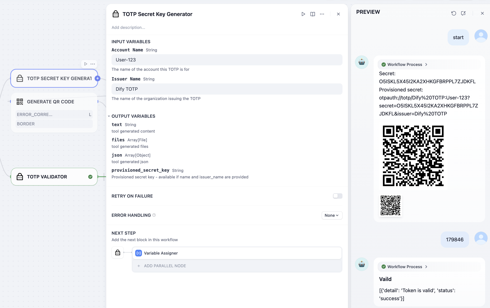
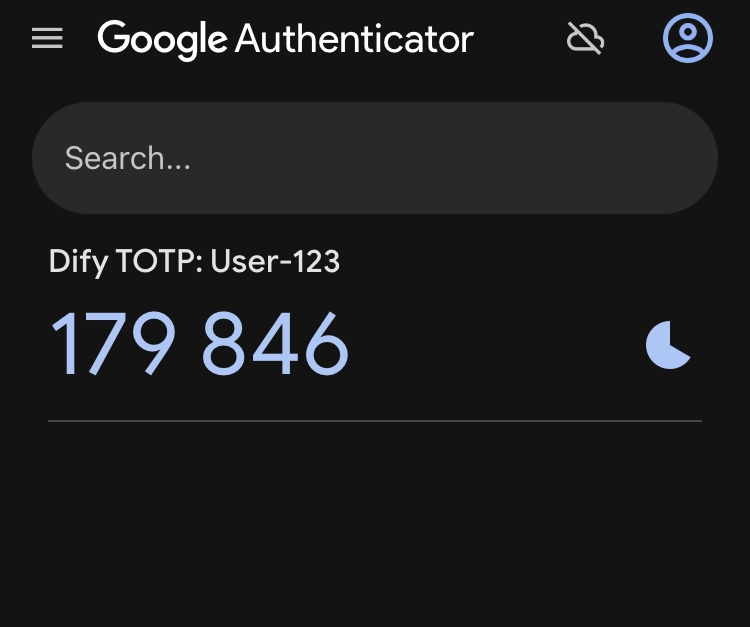

# TOTP Plugin

TOTP (Time-based One-Time Password) is a dynamic authentication mechanism that enhances account security by generating time-sensitive passwords. This plugin provides TOTP verification and key generation capabilities for the Dify platform.

## Getting Started

Repository: [dify-plugins-collections/totp](https://github.com/alterxyz/dify-plugins-collections/tree/main/totp)

For issues, bug reports, or feature requests, please visit our [Issues page](https://github.com/alterxyz/dify-plugins-collections/issues).

Feel free to contribute or provide feedback to help improve this plugin!

## Features

This plugin offers two main tools:

1. **TOTP Validator**

    - Validates 6-digit TOTP codes submitted by users
    - Supports both secret keys and provisioning URIs

2. **TOTP Key Generator**
    - Generates standard-compliant TOTP secret keys
    - Optionally creates configuration with account and issuer information

## Usage

### TOTP Validator

To validate a TOTP code:

- **secret_key**: TOTP secret key or provisioning URI (required)
- **user_code**: 6-digit verification code from user (required)

Returns:

- Text message: Success or failure status
- JSON response: Detailed verification results
    - `status` - Verification result ("success" or "fail")
    - `detail` - Detailed verification information. A 5-second time drift is allowed for compatibility.
- Variable `True_or_False`: Verification result as string ("True" or "False")

### TOTP Key Generator

To generate a new TOTP key:

- **name**: Account name (optional)
- **issuer_name**: Issuer name (optional)

Returns:

- Generated secret key
- Provisioning URI (when account name and issuer name are provided)

## Compatibility with Authenticator Apps

Different authenticator applications have varying levels of support for TOTP setup methods:

- **BitWarden**: Supports both secret keys and provisioning URIs
- **Google Authenticator**: QR code scanning supports provisioning URIs only, manual entry supports secret keys only (requires user to input account name)
- **Microsoft Authenticator**: QR code scanning supports provisioning URIs only
- **Other apps**: Support varies; refer to the specific application's documentation

When implementing TOTP authentication:
- For maximum compatibility, provide both the secret key and a QR code containing the provisioning URI
- For manual setup, ensure users have access to the secret key and relevant account/issuer information

### Example

## Security Considerations

- Keep TOTP secret keys confidential
- Use secure key management solutions for storing TOTP secrets
- Ensure secure communication channels in production environments

## Privacy

This plugin does not collect any user data. See [PRIVACY.md](PRIVACY.md) for details.
